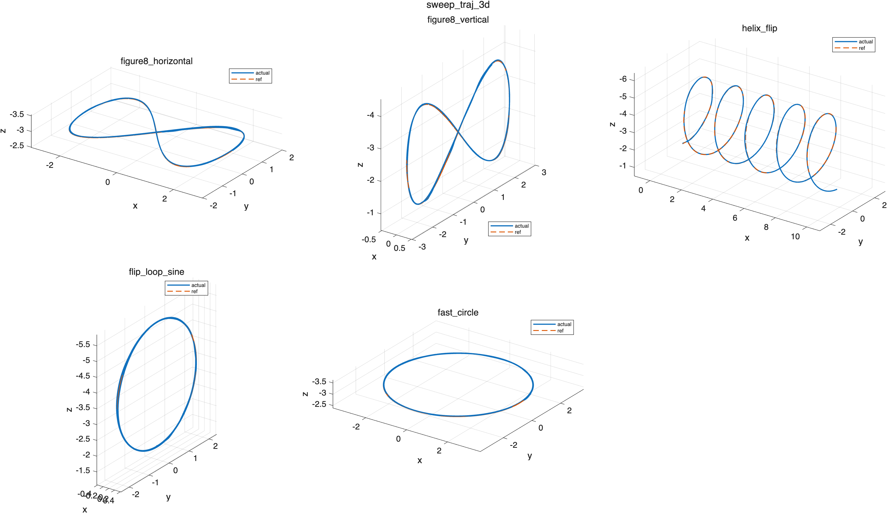
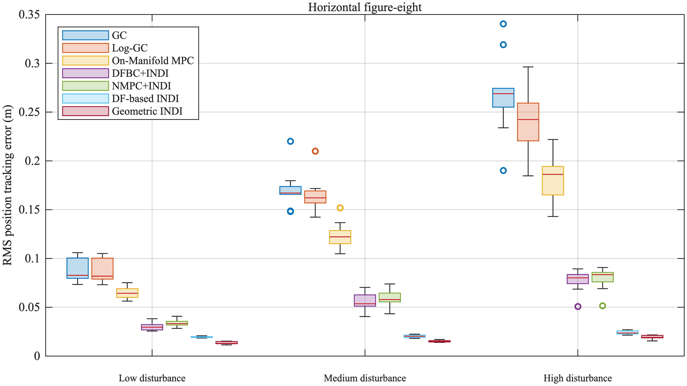
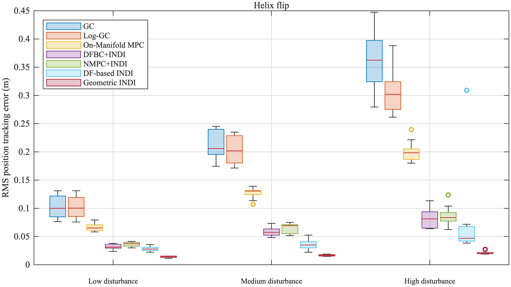

Quadrotor Control Algorithm Benchmark
=====================================

A MATLAB-based quadrotor control simulation benchmark for comparing geometric
control, differential-flatness-based control, INDI, and NMPC controllers under
aggressive trajectories, measurement noise, and external disturbances.

Coordinate convention: simulation states, controller references, and 3D plots
use NED coordinates (`x` north, `y` east, `z` down). 3D figures reverse the
z-axis direction and include a small NED reference triad so positive `z_NED`
appears visually downward.

Benchmark Trajectories And Example Results
------------------------------------------

The first figure shows the benchmark trajectories used in the sweep. The next
two figures show example disturbance Monte Carlo results.







Quick Start
-----------

Run the default single-case simulation:

```matlab
main
```

Run the disturbance benchmark:

```matlab
main_disturbance_benchmark
```

Run the repeated disturbance Monte Carlo benchmark, where each repeated
trajectory run contributes one RMSE sample to the final boxcharts:

```matlab
main_disturbance_monte_carlo
```

Replot Saved Results
--------------------

Saved results can be plotted again without rerunning simulations. Each
simulation entry has a matching plot entry:

| Run simulation | Replot saved result |
| --- | --- |
| `main` | `plot_main` |
| `main_trajectory_sweep` | `plot_main_trajectory_sweep` |
| `main_disturbance_benchmark` | `plot_main_disturbance_benchmark` |
| `main_disturbance_monte_carlo` | `plot_main_disturbance_monte_carlo` |

Run the `plot_*` file directly to redraw saved figures. For example,
`plot_main_disturbance_monte_carlo` redraws the RMSE boxcharts from the last
saved Monte Carlo result and does not run any simulations. Its editable
settings are at the top of the file.

The fixed result locations are:

```text
results/main/main_run.mat
results/main_trajectory_sweep/<controller>/main_trajectory_sweep_results.mat
results/main_trajectory_sweep/<controller>/<trajectory>/main_run.mat
results/disturbance_benchmark/disturbance_benchmark_results.mat
results/disturbance_monte_carlo/<case>/disturbance_benchmark_results.mat
```

The benchmark scripts also call their matching plotting code automatically
when plotting is enabled.

`main.m` currently defaults to:

```matlab
par.controllerName = "px4_iris";
```

To run Sun et al. NMPC in a single case, set:

```matlab
par.controllerName = "sun_nmpc";
```

`main_trajectory_sweep.m` is configured to sweep `sun_nmpc` by default.
The Sun NMPC path is acados-backed; it is not a pure MATLAB implementation.

Noise And Disturbances
----------------------

`main.m` injects measurement noise into the state fed back to the controller:

```matlab
par.feedbackNoise.enabled = true;
```

The plant still integrates the true state `x`; controllers receive `xMeas`.
Both are logged, for example `log.p` and `log.pMeas`. Position, velocity,
attitude, and body-rate white-noise standard deviations are configured under
`par.feedbackNoise`.

INDI controllers should not finite-difference noisy velocity/rate feedback
directly. Tal, Sun `*_indi`, and `geometric_indi` inner-loop INDI filters all
use `par.indi.innerLoopFilterCutoffHz`. Tal and `geometric_indi` outer-loop
INDI filters use `par.indi.outerLoopFilterCutoffHz`.

The default plant disturbance is stochastic:

```matlab
par.disturbance.type = "random";
```

This uses a first-order Gauss-Markov colored-noise model for external force
and moment disturbances. It is a lightweight Dryden-style UAV gust/load model:
white noise is filtered by a correlation time, then scaled by the configured
RMS force and moment levels. Deterministic `"constant"` and `"sin"` disturbance
types are still available for paper comparisons and debugging.

Sun NMPC Dependency Setup
-------------------------

Sun NMPC needs acados. Most users only need to run the installer once from
MATLAB at the repository root:

```matlab
install_acados
```

The script installs acados under `.acados/acados`, creates the repository-local
Python environment `.venv`, installs the required Python packages, and runs a
short `sun_nmpc` smoke test. It automatically selects platform-specific build
options for Apple Silicon and x86_64 machines.

Before running it, make sure these tools are available:

- MATLAB with Python support.
- `git`, `cmake`, and a C/C++ compiler.

To skip the final smoke test:

```matlab
install_acados("RunSunSmokeTest", false)
```

After installation, restart MATLAB if Python was already loaded, `cd` back to
this repository, and run the simulation:

```matlab
main
```

For a batch trajectory test:

```matlab
main_trajectory_sweep
```

If MATLAB reports a Python package error such as `No module named 'casadi'`,
restart MATLAB and run the simulation again so MATLAB uses `.venv/bin/python3`.

Current Sun NMPC Architecture
-----------------------------

The implemented NMPC is in [tools/sun_acados_nmpc.py](tools/sun_acados_nmpc.py).
It follows the Sun/Agilicious Kingfisher platform parameters used in `main.m`:

- State: `x = [p(3); q_wxyz(4); v(3); Omega(3)]`.
- Input: four rotor thrusts `u = [u1; u2; u3; u4]`.
- Allocation map: `G*u = [T; tau_x; tau_y; tau_z]`.
- Horizon: `N = 20`, `dt = 0.05 s`.
- Solver: acados `SQP_RTI`, ERK integration, Gauss-Newton Hessian.
- Input bounds: `0 <= ui <= 8.5 N`.
- Body-rate bounds: `|Omega| <= [10, 10, 4] rad/s`.
- Stage cost:
  - position weights `[200, 200, 500]`;
  - velocity weights `[1, 1, 1]`;
  - tilt/yaw attitude residual weights `[5, 5, 200]`;
  - body-rate weights `[1, 1, 1]`;
  - rotor thrust weights `6*I`.

The public Sun NMPC controller names are:

- `sun_nmpc`: the Sun et al. Eq. (10) nonlinear MPC OCP, solved through
  acados/SQP-RTI internally.
- `sun_nmpc_indi`: the same NMPC outer loop combined with the Sun et al. INDI
  inner loop for disturbance robustness.

acados is an implementation detail of `sun_nmpc`, not a different algorithm.
For NMPC, the internal prediction reference is allowed to continue past
`par.Tend` by the controller horizon, while the MATLAB simulation still stops
exactly at `par.Tend`. The disturbance benchmark can exclude the last
prediction horizon from statistics with:

```matlab
cfg.errorEvalMode = "sun_prediction_horizon";
```

Notes on Other MATLAB NMPC Repositories
---------------------------------------

The Sun NMPC implementation in this repository follows the Sun et al. paper and
the Agilicious/acados implementation style: generated acados solvers with
SQP-RTI-like operation. 

References
----------

[1] T. Lee, M. Leok, and N. H. McClamroch, “Geometric Tracking Control of a Quadrotor UAV on SE(3),” Mar. 10, 2010, arXiv: arXiv:1003.2005. doi: [10.48550/arXiv.1003.2005](https://doi.org/10.48550/arXiv.1003.2005).

[2] T. Lee, M. Leok, and N. H. McClamroch, “Control of Complex Maneuvers for a Quadrotor UAV using Geometric Methods on SE(3),” Nov. 12, 2010, arXiv: arXiv:1003.2005. doi: [10.48550/arXiv.1003.2005](https://doi.org/10.48550/arXiv.1003.2005).

[3] F. Bullo and R. M. Murray, “Proportional derivative (PD) control on the Euclidean group,” 1995.

[4] Y. Yu, S. Yang, M. Wang, C. Li, and Z. Li, “High performance full attitude control of a quadrotor on SO (3),” in 2015 IEEE International Conference on Robotics and Automation (ICRA), Seattle, WA, USA: IEEE, 2015, pp. 1698–1703. doi: [10.1109/icra.2015.7139416](https://doi.org/10.1109/icra.2015.7139416).

[5] D. Brescianini, M. Hehn, and R. D’Andrea, “Nonlinear Quadrocopter Attitude Control: Technical Report,” ETH Zurich, 2013. doi: [10.3929/ETHZ-A-009970340](https://doi.org/10.3929/ETHZ-A-009970340).

[6] M. Faessler, A. Franchi, and D. Scaramuzza, “Differential Flatness of Quadrotor Dynamics Subject to Rotor Drag for Accurate Tracking of High-Speed Trajectories,” IEEE Robotics and Automation Letters, vol. 3, no. 2, pp. 620–626, Apr. 2018, doi: [10.1109/LRA.2017.2776353](https://doi.org/10.1109/LRA.2017.2776353).

[7] J. Sola, “Quaternion kinematics for the error-state Kalman filter,” arXiv:1711.02508 [cs], Nov. 2017, Accessed: Sep. 26, 2020. [Online]. Available: [http://arxiv.org/abs/1711.02508](http://arxiv.org/abs/1711.02508)

[8] D. Brescianini and R. D’Andrea, “Tilt-Prioritized Quadrocopter Attitude Control,” IEEE Transactions on Control Systems Technology, vol. 28, no. 2, pp. 376–387, Mar. 2020, doi: [10.1109/TCST.2018.2873224](https://doi.org/10.1109/TCST.2018.2873224).

[9] J. Johnson and R. Beard, “Globally-Attractive Logarithmic Geometric Control of a Quadrotor for Aggressive Trajectory Tracking,” Dec. 01, 2021, arXiv: arXiv:2109.07025. doi: [10.48550/arXiv.2109.07025](https://doi.org/10.48550/arXiv.2109.07025).

[10] J. Sola, J. Deray, and D. Atchuthan, “A micro Lie theory for state estimation in robotics,” Dec. 08, 2021, arXiv: arXiv:1812.01537. doi: [10.48550/arXiv.1812.01537](https://doi.org/10.48550/arXiv.1812.01537).

[11] E. Tal and S. Karaman, “Accurate Tracking of Aggressive Quadrotor Trajectories Using Incremental Nonlinear Dynamic Inversion and Differential Flatness,” IEEE Trans. Contr. Syst. Technol., vol. 29, no. 3, pp. 1203–1218, May 2021, doi: [10.1109/tcst.2020.3001117](https://doi.org/10.1109/tcst.2020.3001117).

[12] S. Sun, A. Romero, P. Foehn, E. Kaufmann, and D. Scaramuzza, “A Comparative Study of Nonlinear MPC and Differential-Flatness-Based Control for Quadrotor Agile Flight,” Feb. 23, 2022, arXiv: arXiv:2109.01365. Accessed: May 27, 2022. [Online]. Available: [http://arxiv.org/abs/2109.01365](http://arxiv.org/abs/2109.01365)

[13] G. Lu, W. Xu, and F. Zhang, “On-Manifold Model Predictive Control for Trajectory Tracking on Robotic Systems,” IEEE Transactions on Industrial Electronics, vol. 70, no. 9, pp. 9192–9202, Sep. 2023, doi: [10.1109/TIE.2022.3212397](https://doi.org/10.1109/TIE.2022.3212397).
